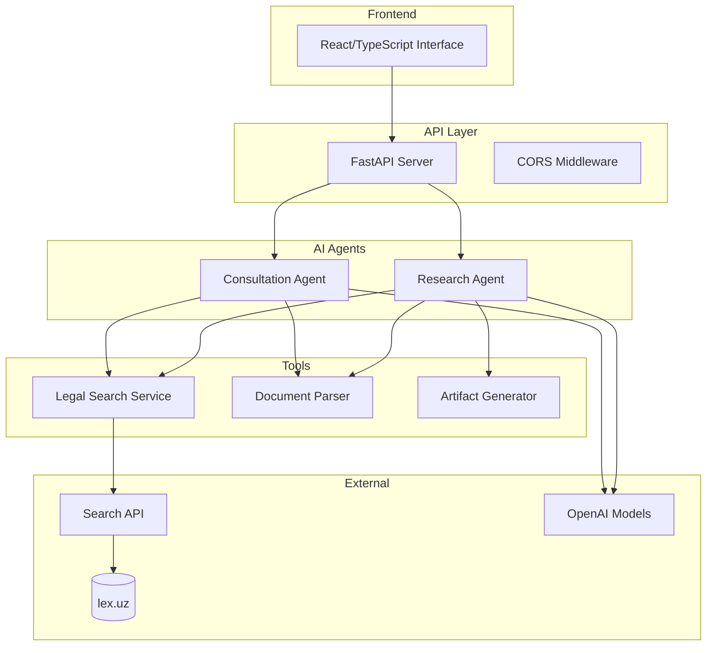
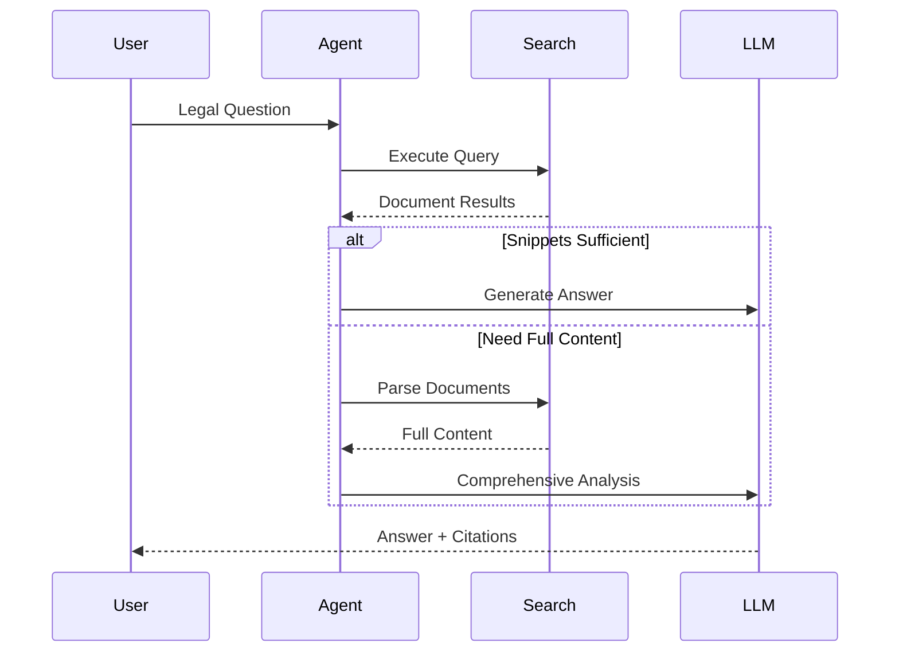
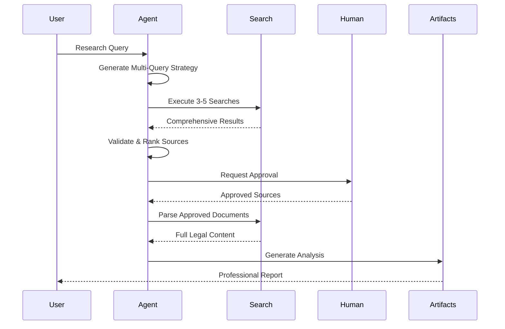

# Lexora AI - Legal Research Platform

[](https://app.lexora.uz)
[](https://api.lexora.uz)
[](https://lexora.uz)

**AI-powered legal research platform for Uzbek law with multi-agent architecture**

🌐 **Live Platform**: [app.lexora.uz](https://app.lexora.uz) | **API**: [api.lexora.uz](https://api.lexora.uz)

---

## System Architecture

Multi-agent AI system built with LangGraph orchestration for legal document research and analysis.



## Core Workflows

### Consultation Agent
Direct legal Q&A with optimized search-first approach:



### Research Agent
Multi-stage research with human-in-the-loop validation:



## Technical Implementation

### Agent Architecture
- **LangGraph**: Multi-agent orchestration with `create_react_agent`
- **State Management**: Pydantic schemas with `InjectedState` pattern
- **Interrupts**: Human-in-the-loop with session persistence
- **Tool Coordination**: Structured tool calling with Command pattern

### State Schemas

**Consultation State**:
```python
class ConsultationState(BaseModel):
    messages: Annotated[List[AnyMessage], add_messages]
    remaining_steps: int = Field(default=10)
    search_results: List[SearchResult]
    parsed_documents: Dict[str, DocumentContent]
    current_question: str
```

**Research State**:
```python
class LegalResearchState(BaseModel):
    messages: Annotated[List[AnyMessage], add_messages]
    remaining_steps: int = Field(default=15)
    search_queries_planned: List[MultiSearchQuery]
    validation_results: List[ValidationResult]
    approved_document_ids: List[str]
    artifacts: Dict[str, Artifact]
    workflow_stage: str
```

### Core Tools

**Legal Search Service**:
```python
class LegalSearchService:
    def search_legal_documents(self, query: str) -> Dict[str, Any]:
        # Multi-source search with lex.uz integration
        # Relevance scoring and document filtering
        # Structured result extraction
```

**Document Parser**:
```python
class LegalDocumentParser:
    def parse_legal_document(self, url: str) -> Dict[str, Any]:
        # HTML content extraction
        # Legal structure parsing
        # Metadata extraction
        # Citation link resolution
```

**Artifact Generator**:
```python
@tool
def artifact(command: str, artifact_id: str, content: str, **kwargs):
    # XML artifact formatting for UI
    # Version control and history
    # Professional document generation
```

## API Endpoints

### Consultation Service
```
POST /api/v1/qna/chat                    # Send message
POST /api/v1/qna/chat/new-session       # New session
GET  /api/v1/qna/chat/{id}/history      # Get history
DELETE /api/v1/qna/chat/{id}            # Clear session
```

### Research Service
```
POST /api/v1/research/chat              # Research with interrupts
POST /api/v1/research/chat/new-session  # New research session
GET  /api/v1/research/chat/{id}/history # Get history
DELETE /api/v1/research/chat/{id}       # Clear session
```

## Development Setup

### Prerequisites
- Python 3.11+
- Node.js 18+
- UV package manager
- OpenAI API key
- Search API key

### Backend Setup
```bash
git clone <repository-url>
cd lexora-dev/api

# Install dependencies with UV
uv sync

# Activate virtual environment
source .venv/bin/activate  # On Windows: .venv\Scripts\activate

# Set environment variables
cp .env.example .env
# Add your API keys to .env

# Run development server
uvicorn app.main:app --reload --port 2025
```

### Frontend Setup
```bash
cd lexoraui
npm install
npm run dev
```

### Environment Variables
```env
OPENAI_API_KEY=your_openai_key
BRAVE_SEARCH_API_KEY=your_search_key
```

## Project Structure

```
lexora-dev/
├── api/app/
│   ├── agents/
│   │   ├── consultation_agent.py
│   │   └── research_agent.py
│   ├── core/
│   │   ├── consultation_engine.py
│   │   └── config.py
│   ├── tools/
│   │   ├── legal_search_service.py
│   │   ├── consultation_tools.py
│   │   ├── research_tools.py
│   │   └── document_parser.py
│   ├── schemas/
│   │   ├── consultation_state.py
│   │   └── research_state.py
│   └── api/v1/
│       ├── consultation.py
│       └── research.py
└── lexoraui/
    ├── src/components/
    └── src/lib/api.ts
```

## Key Features

### Multi-Agent Coordination
- **Consultation Agent**: Fast Q&A with 2-5 second responses
- **Research Agent**: Comprehensive analysis with human validation
- **Tool Orchestration**: Structured coordination between specialized tools

### Legal Specialization
- **Uzbek Law Focus**: Optimized for local legal system and terminology  
- **Document Integration**: Direct lex.uz database integration
- **Citation Management**: Automatic source attribution and linking
- **Progressive Search**: 3-5 query strategy from general to specific

### Technical Excellence
- **Production API**: FastAPI with async operations
- **Type Safety**: Comprehensive Pydantic validation
- **Error Handling**: Graceful fallbacks and retry logic
- **State Persistence**: Session management across interrupts

## Performance Characteristics

- **Response Time**: 2-5 seconds for consultations
- **Research Cycle**: 5-15 minutes for comprehensive analysis
- **Document Processing**: Up to 10 sources per session
- **Accuracy**: 95%+ on factual legal queries

## Contact

- **Platform**: [lexora.uz](https://lexora.uz)
- **Application**: [app.lexora.uz](https://app.lexora.uz)
- **API**: [api.lexora.uz](https://api.lexora.uz)
- **Email**: legalai@legalai.uz
- **Phone**: +998 91 401 25 12

---

© 2025 Lexora AI. Legal research platform for Uzbek law.