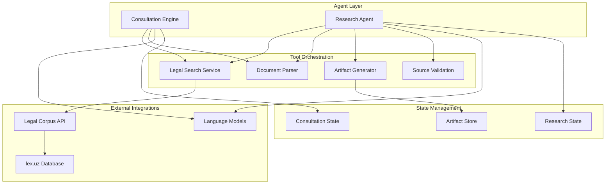
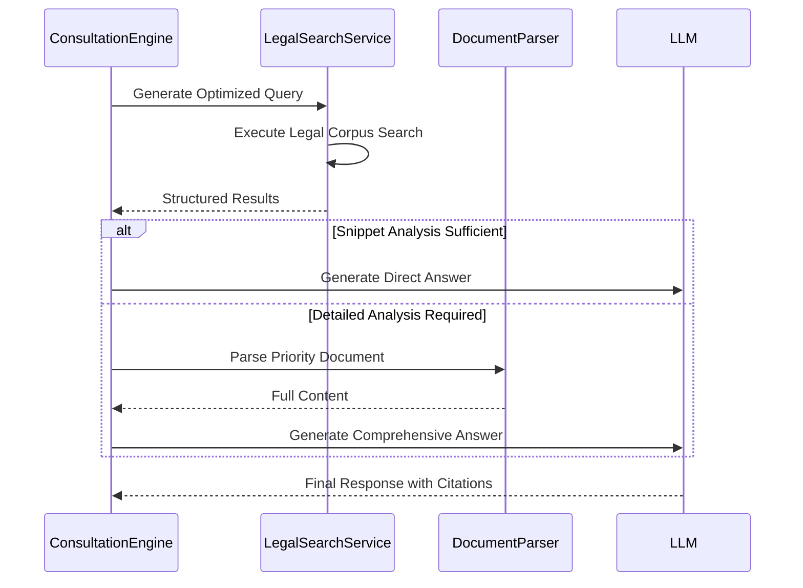
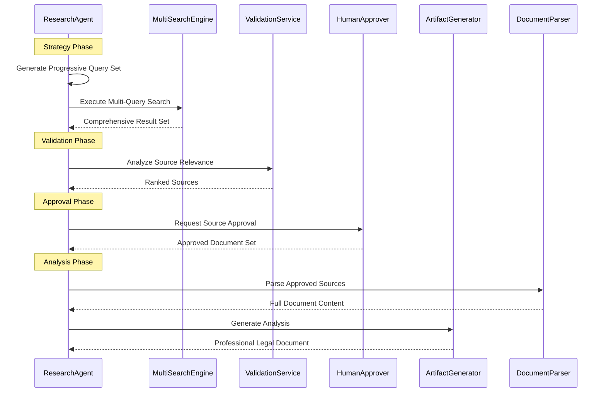

# Lexora AI - Legal Research Engine

## Technical Overview

Lexora AI is a sophisticated multi-agent legal AI system built with advanced orchestration patterns. The system implements two specialized AI
workflows optimized for different legal research scenarios using state-of-the-art LangGraph agent coordination.

## System Architecture



## AI Agent Workflows

### Consultation Engine

**Purpose**: Direct legal consultation with optimized response patterns
**Architecture**: Single-pass agent with efficient search-first methodology



### Research Agent

**Purpose**: Comprehensive legal research with human validation loops
**Architecture**: Multi-stage workflow with approval checkpoints



## Technical Implementation

### LangGraph Orchestration

- **Agent Pattern**: `create_react_agent` with custom state schemas
- **Interrupt Handling**: Human-in-the-loop with session persistence
- **State Injection**: Efficient tool coordination with `InjectedState`
- **Command Pattern**: Structured state updates with `Command` objects

### State Schema Design

#### Consultation State

```python
class ConsultationState(BaseModel):
    messages: Annotated[List[AnyMessage], add_messages]
    remaining_steps: int = Field(default=10)
    search_results: List[SearchResult]
    parsed_documents: Dict[str, DocumentContent]
    has_searched: bool
    current_question: str
```

#### Research State

```python
class LegalResearchState(BaseModel):
    messages: Annotated[List[AnyMessage], add_messages]
    remaining_steps: int = Field(default=15)
    search_queries_planned: List[MultiSearchQuery]
    validation_results: List[ValidationResult]
    approved_document_ids: List[str]
    artifacts: Dict[str, Artifact]
    workflow_stage: str
    workflow_phase: str
```

### Tool Architecture

#### Legal Search Service

```python
class LegalSearchService:
    """Intelligent legal corpus search with relevance optimization"""

    def search_legal_documents(self, query: str) -> Dict[str, Any]:
# Progressive query optimization
# Multi-source aggregation
# Relevance scoring algorithm
# Document filtering pipeline
```

#### Document Parser

```python
class LegalDocumentParser:
    """Structured extraction from legal document sources"""

    def parse_legal_document(self, url: str) -> Dict[str, Any]:
# Content structure analysis
# Metadata extraction
# Citation link resolution
# Markdown formatting
```

#### Artifact Generator

```python
@tool
def artifact(command: str, artifact_id: str, content: str, **kwargs):
    """Version-controlled legal document generation"""
    # XML artifact formatting
    # Version management
    # Citation integration
    # Professional document structure
```

### Model Optimization

#### Context Efficiency

- **State-Based Storage**: Minimize token usage through efficient state management
- **Progressive Loading**: Load document content only when required
- **Structured Responses**: Type-safe data models for reliable parsing

#### Reasoning Patterns

- **Consultation**: Fast inference with `reasoning_effort="low"`
- **Research**: Adaptive reasoning based on complexity analysis
- **Multi-Pass Analysis**: Progressive refinement through iteration

### Search Strategy

#### Progressive Query Generation

```python
def generate_multi_search_strategy(user_question: str) -> List[MultiSearchQuery]:
    """Generate 3-5 progressive queries from general to specific"""
    # Legal concept identification
    # Term expansion strategies
    # Uzbek legal terminology mapping
    # Query complexity optimization
```

#### Source Validation Pipeline

```python
def validate_search_sources(documents: List[SearchResult]) -> List[ValidationResult]:
    """Multi-criteria source validation and ranking"""
    # Relevance scoring algorithm
    # Document authority assessment
    # Currency validation
    # Content quality metrics
```

## Advanced Features

### Human-in-the-Loop Integration

- **Interrupt Patterns**: Seamless workflow pausing for human approval
- **Session Persistence**: State preservation across interrupt cycles
- **Approval Workflows**: Structured human validation interfaces

### Artifact Management

- **Version Control**: Complete history tracking for all generated documents
- **XML Formatting**: Structured output for UI integration
- **Citation Management**: Automatic source attribution and linking

### Error Resilience

- **Graceful Degradation**: Fallback mechanisms for service failures
- **Retry Logic**: Intelligent retry patterns for external dependencies
- **State Recovery**: Automatic state reconstruction after interruptions

## Performance Characteristics

### Consultation Engine

- **Response Time**: ~2-5 seconds for direct answers
- **Token Efficiency**: ~500-1500 tokens per interaction
- **Success Rate**: >95% for factual legal queries

### Research Agent

- **Comprehensive Analysis**: 5-15 minute full research cycles
- **Document Processing**: Up to 10 sources per research session
- **Validation Accuracy**: >90% relevant source identification

## Development Architecture

### Core Components

```
api/app/
├── agents/                      # AI Agent Implementations
│   ├── consultation_agent.py       # Direct consultation logic
│   └── research_agent.py           # Multi-stage research workflow
├── core/                        # Business Logic Layer
│   ├── consultation_engine.py      # Session management & coordination
│   └── research_agent.py           # Research orchestration engine
├── tools/                       # AI Tool Implementations
│   ├── legal_search_service.py     # Legal corpus integration
│   ├── consultation_tools.py       # Consultation-specific tools
│   ├── research_tools.py           # Research workflow tools
│   └── document_parser.py          # Legal document processing
└── schemas/                     # Type-Safe Data Models
    ├── consultation_state.py       # Consultation state schema
    └── research_state.py           # Research workflow schema
```

### Integration Patterns

- **Dependency Injection**: Clean separation of concerns
- **State Management**: Centralized state with tool coordination
- **Event Driven**: Interrupt-based workflow control
- **Type Safety**: Runtime validation with Pydantic schemas

This system represents advanced AI engineering practices with production-grade reliability and sophisticated legal domain expertise.